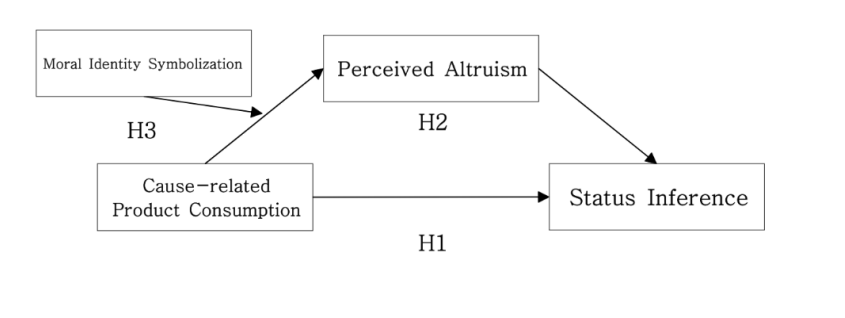
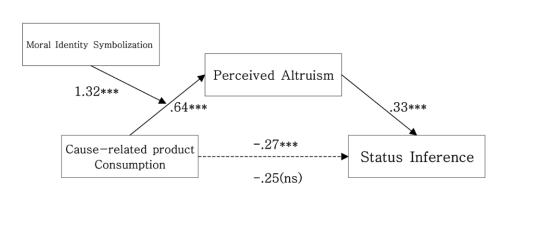

<link rel="stylesheet" href="styles.css" type="text/css">
<link rel="stylesheet" href="site_libs/academicons-1.9.1/css/academicons.min.css"/>

   

## *The Effects of Cause Related Product Consumption on Status Inference by Perceived Altruism and Moral Identity Symbolism *

 

   

### 1. Abstract
 

  + This study examines cause-related product consumption as a costly signal that can imply positive status to others. While existing research typically investigates status consumption for luxury products, this study proposes that cause-related products have become a status symbol. 
  
  + Two studies demonstrate that people confer higher status to cause-related product consumption rather than general product consumption. These positive inferences are driven by perceived altruism and moderated by individual differences in moral identity symbolization in the observers.

 

### 2. Research Framework
 

 

### 3. Hypotheses
 

  + H1: Cause-related product consumption is expected to lead to higher status inferences 
compared to general product consumption.

  + H2: The effect specified in H1 is mediated by perceived altruism.

  + H3: In the effect of cause related products consumption on status inference through the 
perceived altruism, people with high moral identity symbolism will have a stronger effect 
than those with low moral identity symbolism.

 

### 4. Methodology & Results
 

  + Main Effect(H1).
  
     + Cause-related product consumption significantly increases status inference compared to general product consumption.
  
     + There was a significant difference in status inference based on cause-related product consumption, with status inference being significantly higher for cause-related product consumption compared to general product consumption (M no condition=4.779, SD=.779 vs. M condition=5.053, SD= .715, t(146)=-2.217, p=0.028). Thus, the impact of cause-related product consumption on status inference was confirmed to be significant

  + Mediation Effect(H2)
  
     + Perceived altruism mediates the relationship between cause-related product consumption and status inference.
  
     + The mediation analysis showed that perceived altruism mediated the effect of cause related products consumption on status inference. Using methods prescribed by Hayes(2013, model 4), I tested the significance of the mediator by 5000 bootstrapped samples. 
     
     + As a result of analysis using Model 4, both the regression model of the path from cause related products consumption to perceived altruism (F=14.327, p< .001) and the regression model of the pathway from cause related products consumption and perceived altruism to status inference (F=13.515, p < .001) were statistically significant. 
     
     + In addition, as a result of the significance test of the effect of cause related products consumption on the perceived altruism, the perceived altruism increased when cause related products were consumed (B= .642, t(146)=3.785, p=.000). 
     
     + In terms of the effect on status inference when cause related products consumption and perceived altruism are simultaneously inputted, cause related products consumption was found to have an insignificant effect on status inference (B= .078, t(146)=.002, p > .1 ), while the perceived altruism was found to have a significant effect on status inference (B = .305, t(146) = 5.512, p= .000). 
     
     + I also found that perceived altruism mediates the effect of cause-related products consumption on status inference (total effect= .274, 95% CI[.030, .518]; direct effect=.078, 95% CI[-.155, .312]; indirect effect=.196, 95% CI[.083, .336]). 

     + Therefore, the mediating effect of perceived altruism was verified.

  + Moderated Mediation Effect(H3)
  
      + Moral identity symbolism moderates the effect of cause-related product consumption on perceived altruism, with a stronger effect among those high in moral identity symbolism.
   
      + The SPSS PROCESS macro model 1 (Hayes, 2013) was employed to examine whether moral identity symbolism moderates the impact of cause-related products on perceived altruism. The analysis confirmed this moderation effect using SPSS PROCESS macro model 1 (Hayes, 2013). 

      + Moral identity symbolization was identified as a significant moderator of the effect of cause-related products consumption on perceived altruism (B=1.32, t(146)=2.028, p=.049). The conditional indirect effect was most pronounced and statistically significant among individuals high in moral identity symbolization (1 SD above the mean of moral identity symbolization; B=1.176, t(146)=2.416, p=.019). 

     + However, the conditional indirect effect was weakest and not statistically significant among individuals low in moral identity symbolism (1 SD below the mean of moral identity symbolization; B=-.144, t(146)=-.333, p>.1).

 

### 5. The result of the research framework
 

 

+ As predicted, participants in the cause-related products consumption condition inferred a higher status compared to those in the general products condition (H1).

+ Cause-related product consumption, when observed, led participants to associate it with high consumer altruism, resulting in an elevated status inference. In contrast, participants in the general product consumption condition did not exhibit a significant effect on status inference through perceived altruism (H2). 

+ Furthermore, individuals with higher moral identity symbolism demonstrated increased perceived altruism and higher status inference in the case of cause-related products consumption. Conversely, participants with low moral identity symbolism recognized altruism and inferred status regardless of the product, but the difference by product was not statistically significant (H3). 

+ **Consequently, all three hypotheses found support in this experiment**

### 6. Discussion

 

  + The study demonstrates that cause-related product consumption signals higher status through perceived altruism, particularly for individuals with high moral identity symbolism. It extends understanding of status signaling beyond luxury goods and highlights the importance of socio-psychological factors in marketing research, emphasizing prosocial behavior's role in establishing social status. Additionally, it broadens the scope of prosocial behavior beyond direct methods like charity participation.

 

### 7. Full Thesis
 

Please click [HERE](files/msthesis.pdf) for the full thesis.

 

